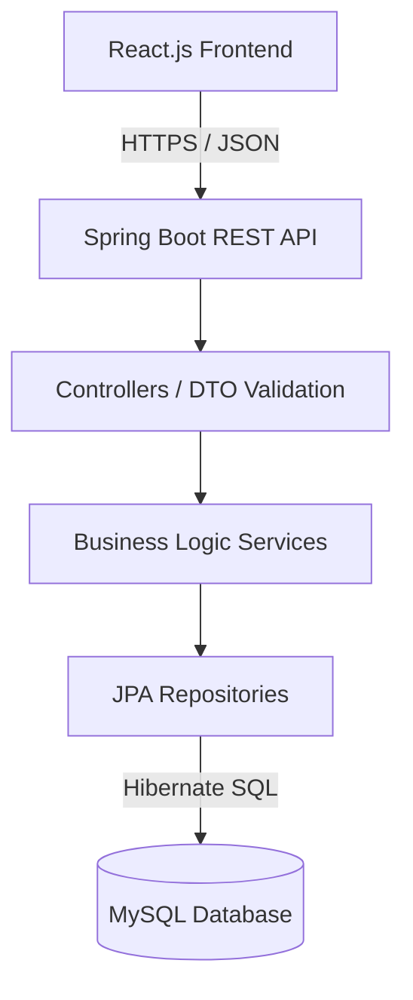

<h1 align="center">
  <br>
  HisabKitab - Advanced Finance & Loan Management
  <br>
</h1>

<h4 align="center">A production-ready Full-Stack portal for tracking compound and simple interest loans securely across Lenders and Borrowers.</h4>

<p align="center">
  <a href="#key-features">Key Features</a> •
  <a href="#tech-stack">Tech Stack</a> •
  <a href="#system-architecture">Architecture</a> •
  <a href="#local-development">Local Setup</a> •
  <a href="#deployment">Deployment Guide</a>
</p>

---

## 📖 Overview

**HisabKitab** is a comprehensive, enterprise-grade financial tracking application built to manage complex loan schedules. Unlike basic expense trackers, HisabKitab is designed around mathematically rigorous lending principles, supporting both **Simple Interest** and **Compound Interest** instruments, complete with dynamically recalculating amortization schedules for partial prepayments.

The platform employs a rigid **Role-Based Access Control (RBAC)** architecture, separating users into `ADMIN`, `LENDER`, and `BORROWER` portals. Lenders can seamlessly orchestrate loan pipelines, while Borrowers maintain a read-only portal to view upcoming schedules, transaction history, and their total outstanding liability.

---

## ✨ Key Features

- **Dynamic Interest Engines**: Natively calculates Simple and Compound interest curves with `java.math.BigDecimal` strict precision, avoiding standard floating-point corruption.
- **Smart Prepayments**: Accepting partial principal prepayments dynamically recalculates the exact future interest obligations without penalizing the borrower.
- **Role-Based Access Control (RBAC)**: Deeply protected Spring Security endpoints utilizing stateless JWT tokens.
  - 🛡️ **Lender Portal**: Manage borrowers, issue loans, record payments, and view global analytics.
  - 🏠 **Borrower Portal**: Isolated, read-only dashboard for clients to track their personal obligations.
  - ⚙️ **Admin Portal**: Oversee the entire platform and moderate users.
- **Semantic Error Parsing**: The backend employs strict validation constraints (`@DecimalMin`, `@Size`, division-by-zero proofs) and bubbles explicit `400 Bad Request` logic directly to the React layer for elegant UI toasts.
- **Premium Glassmorphism GUI**: Highly responsive, aesthetic React interface utilizing custom CSS variables, layout isolating components, and active loading state protectors.

---

## 🛠️ Tech Stack

### Frontend (Client Tier)
- **Framework:** React.js 19
- **Build Tool:** Vite
- **Routing:** React Router v7 (`BrowserRouter`, `ProtectedRoute` intercepts)
- **HTTP Client:** Axios (Configured with dynamic URL interceptors & auto-401 handling)
- **Styling:** Vanilla CSS3 Data-Tokens (Glassmorphism, Dark/Light palettes)

### Backend (Logic Tier)
- **Framework:** Java Spring Boot 3
- **Security:** Spring Security & JWT (JSON Web Tokens)
- **ORM:** Hibernate (Spring Data JPA)
- **Validation:** Jakarta Bean Validation (JSR 380)
- **Data Types:** `BigDecimal`, `LocalDate` (Financial consistency)

### Database (Data Tier)
- **Engine:** MySQL 8

---

## 🏗️ System Architecture

HisabKitab utilizes a strict **Client-Server MVC** architectural pattern:



### Database Isolation (The "Lender-Borrower" Construct)
Every Borrower Entity belongs to strictly *one* Lender. The backend JPA queries (`findByLender`) explicitly inject the `User` principal pulled directly from the JWT verification filter. It is physically impossible for Lender A to query, modify, or leak Lender B's financial data, regardless of the API endpoints invoked.

---

## 🚀 Local Development (Getting Started)

### Prerequisites
1. **Node.js** (v18+)
2. **Java Development Kit (JDK)** 17 or 21
3. **MySQL Server** (running locally on port `3306`)

### 1. Database Setup
Ensure MySQL is running. The Spring Boot backend is configured to automatically generate the `hisabkitab` schema if it doesn't exist, provided the credentials match `root/root`.

### 2. Backend Initialization
```bash
cd backend
# The application.properties defaults to localhost:3306 and root/root
./mvnw clean install
./mvnw spring-boot:run
```
*The REST API will launch on `http://localhost:8080/api`*

### 3. Frontend Initialization
```bash
cd frontend
npm install

# The .env file isolates the API endpoint connection
npm run dev
```
*The React GUI will launch on `http://localhost:5173`*

---

## 🌩️ Production Deployment Guide

The application has been abstracted to rely entirely on **Environment Variables** for secrets, making it cloud-native and deployable to free PaaS networks.

### Database (e.g., Aiven / TiDB)
Create a remote MySQL database and secure the JDBC URL, Username, and Password.

### Backend Deployment (e.g., Render.com)
Deploy the `backend/` directory as a Java Web Service.
Provide the following Environment Variables in the Render dashboard:
- `DB_URL`: (e.g., `jdbc:mysql://your-remote-host:3306/hisabkitab`)
- `DB_USERNAME`: Database user
- `DB_PASSWORD`: Database password
- `JWT_SECRET`: A long, random Base64 cryptographic string
- `JWT_EXPIRATION`: `86400000`
- `ALLOWED_ORIGINS`: *[Leave blank initially, update after deploying the frontend]*

### Frontend Deployment (e.g., Vercel / Netlify)
Deploy the `frontend/` directory as a Vite Application.
Provide the following Environment Variable in the Vercel dashboard:
- `VITE_API_URL`: The URL of your live Render backend (e.g., `https://hisab-api.onrender.com/api`).

**Final Handshake:** Copy the domain Vercel gave you (e.g., `https://hisabkitab.vercel.app`) and paste it into the backend's `ALLOWED_ORIGINS` environment variable on Render to safely unlock CORS traffic.

---
*Architected and engineered for precision.*
